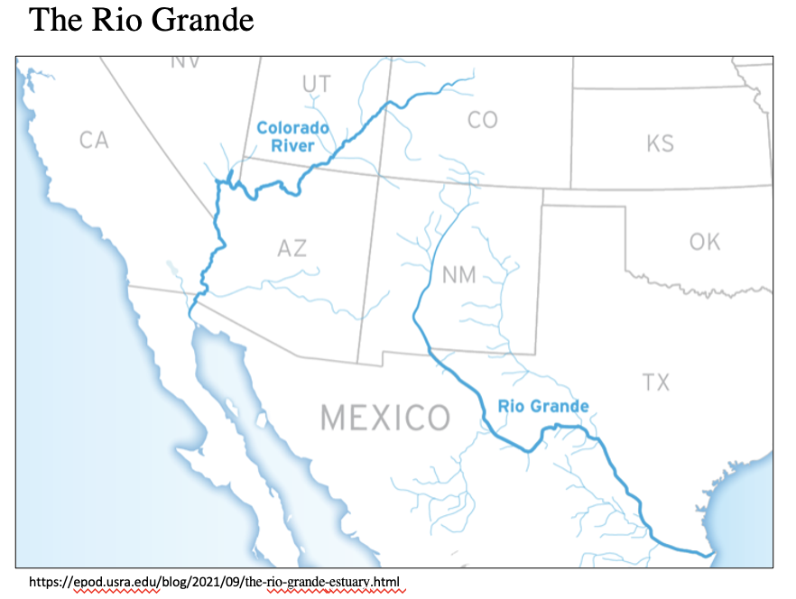
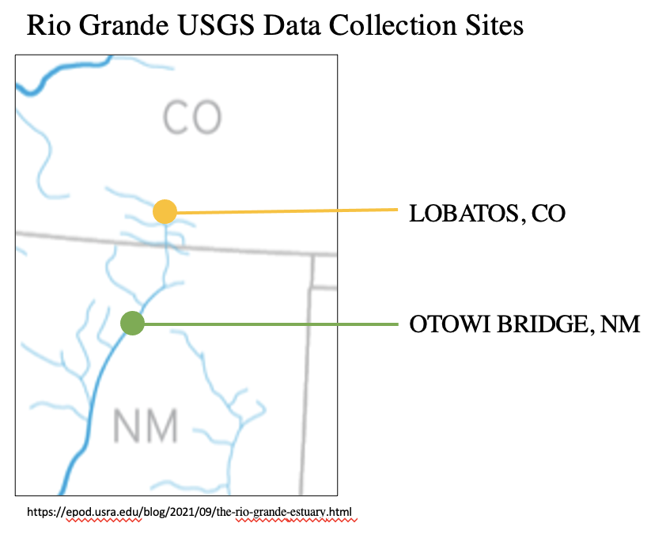

\newpage

```{r setup, message = FALSE, warning = FALSE, include = FALSE, results = FALSE}
getwd()

library(tidyverse)
library(lubridate)
library(dataRetrieval)
library(cowplot)
library(trend)
library(forecast)
library(tseries)
library(kableExtra)
library(patchwork)


theme_set(theme_classic())
options(scipen = 4) #sets the number of decimal places that appear in output
```


```{r read in data, message = FALSE, warning = FALSE, include = FALSE, results = FALSE}
LOBATOS_processed<-read.csv("../Data/Processed/LOBATOS_processed.csv")
LOBATOS_long<-read.csv("../Data/Processed/LOBATOS_long.csv")
LOBATOSFlow_summary<-read.csv("../Data/Processed/LOBATOSFlow_summary.csv")

OTOWI_processed<-read.csv("../Data/Processed/OTOWI_processed.csv")
OTOWI_long<-read.csv("../Data/Processed/OTOWI_long.csv")
OTOWIFlow_summary<-read.csv("../Data/Processed/OTOWIFlow_summary.csv")
```

```{r create pre post data frames, message = FALSE, warning = FALSE, include = FALSE, results = FALSE}

LOBATOS_processed$Date<-ymd(LOBATOS_processed$Date)
OTOWI_processed$Date<-ymd(OTOWI_processed$Date)

LOBATOS_processed<- LOBATOS_processed%>% 
  filter(Year>2007)

LOBATOS_pre<- LOBATOS_processed%>% 
  filter(Year<2014)

LOBATOS_post<- LOBATOS_processed%>% 
  filter(Year>2014)

OTOWI_processed<- OTOWI_processed%>% 
  filter(Year>2007)

OTOWI_pre<- OTOWI_processed%>% 
  filter(Year<2014)

OTOWI_post<- OTOWI_processed%>% 
  filter(Year>2014)
```

# Rationale and Research Questions

The Rio Grande supplies water for wildlife and millions of people along it's path. The health of it's waterways is key to sustaining the health of of people that depend on it. The Rio Grande is essential to the economic growth of the states through which it runs. The Rio Grande begins at it's headwaters in southern Colorado, continues south into New Mexico, before traveling along the boarder of Mexico and Texas.   

The communities in Colorado and New Mexico acknowledge it's important and have been collaborating across secotrs to secure water quantity and quality for generations to come. With the help of The Nature Conservancy, the Rio Grande Water Fund was established in 2014. The purpose of the fund is to restore 600,000 acres of forests in northern New Mexico and Southern Colorado (The Nature Conservancy, 2020). This study preformed in this paper conducts an assessment of water quantity and quality parameters on the Gio Grande to assess if the restoration projects implemented through the Rio Grande Water Fund have been successful in their objectives.   

The analysis of the study seeks to answer the following questions:  

1.    Has water quantity increased in the river since the fund was implemented?
2.    Has water quality increased in the river since the fund was implemented, specifically suspended sediment and phosphorus?  

```{r , message = FALSE, warning = FALSE, echo = FALSE, results = TRUE, out.width = '75%', fig.align="center"}

```
  
```{r , message = FALSE, warning = FALSE, echo = FALSE, results = TRUE, out.width = '75%', fig.align="center"}

```
\newpage

# Dataset Information

The data for this analysis was taken for USGS stream gauge data base between 2000-2021 at two different locations, Lobatos, CO and Otowi Bridge, NM, USGS code numbers 08251500 and 08313000 respectively. At Lobatos, CO data was collected for total phosphorus in the water in mg/L. At Otowi Bridge, NM data was collected for suspended sedimentation concentration in the water also in mg/L. Additionally, discharge data in cfs was collected for both sites. It was difficult to locate gauge stations on the upper Rio Grande that had both phosphorus and sedimentation data for the the desired period of time. Consistent data from the same gauge station for this period was unavailable, thus two different gauge locations where used. Sedimentation data at Otowi Bridge is daily data for the entire time period. Phosphorus data at Lobatos was only available for roughly 6 months out of the year, every year. This was the most consistent phosphorus sampling data found. Discharge data was available for for the entire time period.  

```{r, data summary, message = FALSE, warning = FALSE, include = FALSE, results = FALSE}

Site<-c( "Lobatos, CO", "Lobatos, CO", "Otowi, NM", "Otowi, NM")
Parameter<-c("Phosphorus", "Discharge","Sedimentation","Discharge" )
Observations<-c( 229, 229,3509,3509 )
Code<-c( 08251500, 08251500,08313000,08313000 )
Units<-c("mg/L", "cfs","mg/L","cfs" )
summary<-data.frame(Site, Parameter, Observations, Code, Units)

summary_data<-summary %>%
  kbl()  %>%
  kable_styling() %>% 
 add_header_above(c("Summary of Data"=5))
```

```{r,message = FALSE, warning = FALSE, echo = FALSE, results = TRUE}
summary_data
```


The data was read in directly from the USGS data base using functions whatNWISdata and readWQPqw. Wrangling the water quality data required reading in all available water quality parameters and filtering the dataset for the desired parameters. Data was grouped and summarised by day, columns were renamed and NA's were dropped from the data set. The data frame was pivoted from longer to wider and joined with the selected parameters from the discharge dataset for each location. Further into the analysis, the location data ets were split into pre and post water fund implementation, 2001-2007 and 2008-2021 respectively.  

\newpage

# Exploratory Analysis 
The data for each site was explored over the entire time period captured and for the pre and post water fund periods for each water parameter. A visual analysis of line graphs of the data appear to reveal some characteristics of the how the Rio Grande water quantity and quality is changing. 

## Lobatos, CO
At the Lobatos gauge site there seems to be a trend of decreasing discharge over time as well as well as a slight decreasing trend in phosphorus over time as well. A closer look at the pre and post fund data shows this relationship at a finer scale. The project objectives were to cause an increase in river discharge and a decrease in phosphorus over time. This data shows that the project interventions did not have an apparent effect on these water quantity and quality measures a Lobatos.  

### 2007-2021
```{r 2007-2021 looking at stream gauge data over time, out.width = '50%', message = FALSE, warning = FALSE, echo = FALSE, results = TRUE}
#2007-2021
ggplot(LOBATOS_processed, aes(x = Date, y = Phosphorus_mg.L)) +
  geom_point(color = "#FF6666") +
  #geom_hline(yintercept = 200, lty = 2) + #EPA ____recreational criteria for freshwater
  scale_y_log10() +
  labs(x = "Date", y = "Phosphorus mg/L", title = "Lobatos, CO Phosphorus Concentration 2007-2021")+
    geom_smooth(method = "lm", se = FALSE, color = "black") 

ggplot(LOBATOS_processed, aes(x=Date, y=Discharge_cfs)) +
  geom_line(color = "#6600FF")+
  scale_y_log10() +
  labs(x = "Date", y = "Discharge cfs", title = "Labatos, CO Discharge 2007-2021")+
    geom_smooth(method = "lm", se = FALSE, color = "black") 

ggplot(OTOWI_processed, aes(x = Date, y = SuspendedSedimentConcentration_mg.L)) +
  geom_point(color = "#FF6633") +
  scale_y_log10() +
    geom_smooth(method = "lm", se = FALSE, color = "black") +
  labs(x = "Date", y = expression("Suspended Sediment Concentration mg/L"), title = "Otowi, NM Suspended Sediment 2007-2021")+
  scale_x_date(name = 'Date', date_breaks = '1 years',
        date_labels = '%Y')

ggplot(OTOWI_processed, aes(x=Date, y=Discharge_cfs)) +
  geom_line(color = "#66CCCC")+
  scale_y_log10() +
  labs(x = "Date", y = "Discharge cfs", title = "Otowi, NM Discharge 2007-2021")+
    geom_smooth(method = "lm", se = FALSE, color = "black")
```

### 2007-2014
```{r 2007-2014 looking at stream gauge data over time, out.width = '50%', message = FALSE, warning = FALSE, echo = FALSE, results = TRUE}
#2007-2014
ggplot(LOBATOS_pre, aes(x = Date, y = Phosphorus_mg.L)) +
  geom_point(color = "#FF6666") +
  #geom_hline(yintercept = 200, lty = 2) + #EPA ____recreational criteria for freshwater
  scale_y_log10() +
  labs(x = "Date", y = "Phosphorus mg/L)", title = "Lobatos, CO Phosphorus 2007-2014")+
    geom_smooth(method = "lm", se = FALSE, color = "black") 

ggplot(LOBATOS_pre, aes(x=Date, y=Discharge_cfs)) +
  geom_line(color = "#6600FF")+
  scale_y_log10() +
  labs(x = "Date", y = "Discharge cfs", title = "Lobatos, CO Discharge 2007-2014")+
    geom_smooth(method = "lm", se = FALSE, color = "black") 

ggplot(OTOWI_pre, aes(x = Date, y = SuspendedSedimentConcentration_mg.L)) +
  geom_point(color = "#FF6633") +
  scale_y_log10() +
  labs(x = "Date", y = expression("Suspended Sediment Concentration mg/L"), title = "Otowi, NM Suspended Sediment 2007-2014")+
  scale_x_date(name = 'Date', date_breaks = '1 years',
        date_labels = '%Y')+
  geom_smooth(method = "lm", se = FALSE, color = "black")

ggplot(OTOWI_pre, aes(x=Date, y=Discharge_cfs)) +
  geom_line(color = "#66CCCC")+
  scale_y_log10() +
  labs(x = "Date", y = "Discharge cfs", title = "Otowi, NM Discharge 2007-2014")+
    geom_smooth(method = "lm", se = FALSE, color = "black")
```

### 2014-2021
```{r 2014-2021 looking at stream gauge data over time, out.width = '50%', message = FALSE, warning = FALSE, echo = FALSE, results = TRUE}
#2014-2021
ggplot(LOBATOS_post, aes(x = Date, y = Phosphorus_mg.L)) +
  geom_point(color = "#FF6666") +
  #geom_hline(yintercept = 200, lty = 2) + #EPA ____recreational criteria for freshwater
  scale_y_log10() +
    geom_smooth(method = "lm", se = FALSE, color = "black") +
  labs(x = "Date", y = "Phosphorus mg/L)", title = "Lobatos, CO Phosphorus 2014-2021")

ggplot(LOBATOS_post, aes(x=Date, y=Discharge_cfs)) +
  geom_line(color = "#6600FF")+
  scale_y_log10() +
  labs(x = "Date", y = "Discharge cfs", title = "Lobatos, CO Discharge 2014-2021")+
    geom_smooth(method = "lm", se = FALSE, color = "black") 

ggplot(OTOWI_post, aes(x = Date, y = SuspendedSedimentConcentration_mg.L)) +
  geom_point(color = "#FF6633") +
  scale_y_log10() +
  geom_smooth(method = "lm", se = FALSE, color = "black") +
  labs(x = "Date", y = expression("Suspended Sediment Concentration mg/L"), title = "Otowi, NM Suspended Sediment 2014-2021")+
  scale_x_date(name = 'Date', date_breaks = '1 years',
        date_labels = '%Y')

ggplot(OTOWI_post, aes(x=Date, y=Discharge_cfs)) +
  geom_line(color = "#66CCCC")+
  scale_y_log10() +
  labs(x = "Date", y = "Discharge cfs", title = "Otowi, NM Discharge 2014-2021")+
    geom_smooth(method = "lm", se = FALSE, color = "black") 


```

## Otowi Bridge, NM
At the Otowi Bridge gauge site there does not seem to be a trend in discharge data over the entire time period, but in both the pre and post fund scenarios a negative discharge trend appears. The Project was hoping to see an increase in river discharge after project was implemented. These results are not showing that the project interventions were successful in this way. The sedimentation data appears to show an increasing trend in sediment load before the fund implementation and a decreasing trend in sedimentation after the fund was implemented, right around 2014/2015. This infers that the restoration projects are succeeding in reducing sediment load and improving water quality in this regard.   


\newpage

# Analysis
Further analysis of the data involved investigating if there is a linear relationship between phosphorus levels in the water and discharge, as well as sedimentation levels in the water and discharge. The results of both linear models resulted in significant positive relationships between these variables (p< 0.05). As discharge increases there are higher levels of phosphorus and sedimentation in the water.


```{r, message = FALSE, warning = FALSE, echo = FALSE, results = TRUE}
ggplot(LOBATOS_processed, aes(x = Discharge_cfs, y = Phosphorus_mg.L)) +
  geom_point(color = "#6600FF")+
  geom_smooth(method = "lm", se = FALSE, color = "black") +
  scale_x_log10() +
  scale_y_log10() +
  labs(x = "Flow (cfs)", y = "Phosphorus mg/L)", title = "Lobatos, CO Suspended Sedimentation by Discharge")
```

 
```{r , message = FALSE, warning = FALSE, include = FALSE, results = FALSE}
summary(lm(data = LOBATOS_processed, log10(Phosphorus_mg.L) ~ log10(Discharge_cfs)))
#signigicant neg slope of flow on phosphorus, R2= flow only explains 9% of phosphorus
```
Additional analysis was also preformed to explore trends over time at Otowi Bridge. The initial exploratory analysis indicated there would be a decreasing trend in sedimentation beginning around the fund implementation time. To see if this relationship is significant a Seasonal Man Kendall (SMK) test was preformed. A SMK test is appropriate for this location given there is monthly data available for all years and there is a seasonal trend in the data. The SMK test revealed that there is not a significant relationship in sedimentation or discharge over time before the water fund was implemented (p> 0.05), nor for discharge over time after fund implementation (p> 0.05). However, the SMK test resulted is a nearly significant relationship in sedimentation over time after 2014 (p=.07). This further analysis indicates that although the inital analysis seems to reveal positive relationships in the data, the trends are not significant. 


```{r, message = FALSE, warning = FALSE, echo = FALSE, results = TRUE}
ggplot(OTOWI_processed, aes(x = Discharge_cfs, y = SuspendedSedimentConcentration_mg.L)) +
  geom_point(color = "#FF6633") +
  geom_smooth(method = "lm", se = FALSE, color = "black") +
  scale_x_log10() +
  scale_y_log10() +
  labs(x = "Flow (cfs)", y = "Suspended Sediment Concentration mg/L", title = "Otowi, NM Suspended Sedimentation by Discharge")
```


```{r, message = FALSE, warning = FALSE, include = FALSE, results = FALSE}
summary(lm(data = OTOWI_processed, log10(SuspendedSedimentConcentration_mg.L) ~ log10(Discharge_cfs)))
#sig slope of flow on conductivity, R2 flow only explains 8% of SuspendedSedimentConcentration
```

Research questions 1 and 2 were answered through this analysis. 
1.    Water quantity has not increased in the river since the fund was implemented.
2.    Water quality has increased in the river since the fund was implemented, but not significantly. Specifically, suspended sediment as decreased slightly, and phosphorus has continued an a very slight decreasing trend since prior to fund implementation.


```{r OTOWI Time Series PRE, message = FALSE, warning = FALSE, include = FALSE, results = FALSE}
#discharge
OTOWI_discharge_monthly_PRE <- OTOWI_pre %>%
  mutate(Year = year(Date),
         Month = month(Date)) %>%
  group_by(Year, Month) %>%
  summarise(Discharge_cfs = sum(Discharge_cfs)*1.98347) #acre feet per month

OTOWI_discharge_timeseries_PRE <- ts(OTOWI_discharge_monthly_PRE$Discharge_cfs, frequency = 12,
                           start = c(2007, 1, 1), end = c(2021, 12, 1))

OTOWI_discharge_Decomposed_PRE <-stl(OTOWI_discharge_timeseries_PRE, s.window = "periodic") 

plot(OTOWI_discharge_Decomposed_PRE)

#SS
OTOWI_SS_monthly_PRE<- OTOWI_pre %>%
  mutate(Year = year(Date),
         Month = month(Date)) %>%
  group_by(Year, Month) %>%
  summarise(SuspendedSedimentConcentration_mg.L = max(SuspendedSedimentConcentration_mg.L)) #acre feet per month

OTOWI_SS_timeseries_PRE <- ts(OTOWI_SS_monthly_PRE$SuspendedSedimentConcentration_mg.L, frequency = 12,
                           start = c(2007, 1, 1), end = c(2021, 12, 1))

OTOWI_SS_Decomposed_PRE <-stl(OTOWI_SS_timeseries_PRE, s.window = "periodic") 


plot(OTOWI_SS_Decomposed_PRE)

#discharge
# Run SMK test (seasonal man kendal)
OTOWI_discharge_trend_PRE <- smk.test(OTOWI_discharge_timeseries_PRE)

# Inspect results
OTOWI_discharge_trend_PRE
summary(OTOWI_discharge_trend_PRE)

#SS
# Run SMK test (seasonal man kendal)
OTOWI_SS_trend_PRE <- smk.test(OTOWI_SS_timeseries_PRE)

# Inspect results
OTOWI_SS_trend_PRE
summary(OTOWI_SS_trend_PRE)
```


```{r OTOWI Time Series POST, message = FALSE, warning = FALSE, include = FALSE, results = FALSE}
#discharge
OTOWI_discharge_monthly_Post <- OTOWI_post %>%
  mutate(Year = year(Date),
         Month = month(Date)) %>%
  group_by(Year, Month) %>%
  summarise(Discharge_cfs = sum(Discharge_cfs)*1.98347) #acre feet per month

OTOWI_discharge_timeseries_Post <- ts(OTOWI_discharge_monthly_Post$Discharge_cfs, frequency = 12,
                           start = c(2007, 1, 1), end = c(2021, 12, 1))

OTOWI_discharge_Decomposed_Post <-stl(OTOWI_discharge_timeseries_Post, s.window = "periodic") 

plot(OTOWI_discharge_Decomposed_Post)

#SS
OTOWI_SS_monthly_Post <- OTOWI_post %>%
  mutate(Year = year(Date),
         Month = month(Date)) %>%
  group_by(Year, Month) %>%
  summarise(SuspendedSedimentConcentration_mg.L = max(SuspendedSedimentConcentration_mg.L)) #acre feet per month

OTOWI_SS_timeseries_Post <- ts(OTOWI_SS_monthly_Post$SuspendedSedimentConcentration_mg.L, frequency = 12,
                           start = c(2007, 1, 1), end = c(2021, 12, 1))

OTOWI_SS_Decomposed_Post <-stl(OTOWI_SS_timeseries_Post, s.window = "periodic") 


plot(OTOWI_SS_Decomposed_Post)

#discharge
# Run SMK test (seasonal man kendal)
OTOWI_discharge_trend_Post <- smk.test(OTOWI_discharge_timeseries_Post)

# Inspect results
OTOWI_discharge_trend_Post
summary(OTOWI_discharge_trend_Post)

#SS
# Run SMK test (seasonal man kendal)
OTOWI_SS_trend_Post <- smk.test(OTOWI_SS_timeseries_Post)

# Inspect results
OTOWI_SS_trend_Post
summary(OTOWI_SS_trend_Post)
```

\newpage

# Summary and Conclusions
Although the restoration interventions implemented through the water fund creation appeared to achieve their objectives, relationships were not significant. Water funds are put in place to be active for decades if not into perpetuity. Therefore, this water fund and it's operations are young. The 600,000 acres of forest have not all be restored. There is potential for increased impact to be observed after more time. 

Water fund models are extensively researched before their implementation and are specifically tailored to the project location. These models have had great success achieving their desired outcomes in various watersheds around the world. Further analysis should be completed at a later date to confirm if the project interventions are successful. 

\newpage

# References
The Nature Conservancy. (2020). Rio grande water fund.https://www.nature.org/en-us/about-us/where-we-work/united-states/new-mexico/stories-in-new-mexico/new-mexico-rio-grande-water-fund/
